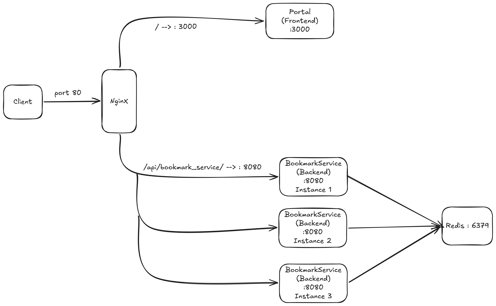

# Deployment

This repository manages and deploys all services for the Bookmark Management project.

## System Overview

| Service | Image | Port | Role |
|---------|-------|------|------|
| **nginx** | `nginx:alpine` | `80` (public) | Reverse proxy — routes requests and load balances between backend instances |
| **portal** | `ebvn/bookmark-app-portal:dev` | `3000` (internal) | Frontend — web UI for end users |
| **bookmark_service** | `ththi/bookmark_service:latest` | `8080` (internal) | Backend API — handles business logic, can be scaled to multiple instances |
| **redis** | `redis:alpine` | `6379` (internal) | Datastore — stores bookmark data |

## Architecture Diagram

<!-- To add your diagram image, follow these steps:
  1. Put your image file into this repo (e.g. docs/architecture.png)
  2. Replace the line below with:
     
-->



## Request Flow

```
Client ─── port 80 ───▶ Nginx
                          │
                          ├── /                        ──▶ Portal (Frontend :3000)
                          │
                          └── /api/bookmark_service/   ──▶ BookmarkService :8080 (x N instances)
                                                                  │
                                                                  ▼
                                                             Redis :6379
```

1. **Client** sends a request to **Nginx** on port `80`
2. **Nginx** routes the request based on the URL path:
   - `/` → forwards to **Portal** (`:3000`) — serves the web UI
   - `/api/bookmark_service/` → forwards to **Bookmark Service** (`:8080`) — handles API calls
3. When multiple **Bookmark Service** instances are running, Nginx load balances across them (round-robin)
4. Each **Bookmark Service** instance connects to **Redis** (`:6379`) to read and write data

## Getting Started

```bash
# Start all services
docker-compose up -d

# Scale Bookmark Service (e.g. 3 instances)
docker-compose up -d --scale bookmark_service=3

# Stop all services
docker-compose down
```
